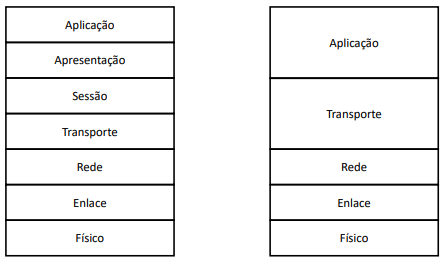

### Camadas
---
As camadas são úteis para caso vc queira alterar apenas um protocolo, é possível fazer isso e manter os outros padrões.

<span style="color: pink;">FÍSICO:</span> Dispositivos/Hardwares e Ondas e Sinais elétricos, sendo responsável pela transmissão das mensagens <br>
<span style="color: pink;">ENLACE:</span> Cuidam da comunicação entre duas máquinas conectadas <br>
<span style="color: pink;">REDE:</span> Endereçãmento e Roteamento (escolhe a rota) <br>
<span style="color: pink;">TRANSPORTE:</span> Cuida da comunicação entre a origem e o destino <br>
<span style="color: pink;">SESSÃO:</span> Separa os aplicativos dentro de uma mesma máquina, direciona as mensgens para o aplicativo certo <br>
<span style="color: pink;">APRESENTAÇÃO:</span> Interpreta as requisições da camada de aplicação e uniformiza as mensagens <br>
<span style="color: pink;">APLICAÇÃO:</span> Ficam os aplicativos <br>

**Observações:**
* Ocorre o envelopamento na camada de <span style="color: pink;">**TRASNPORTE**</span>, <span style="color: pink;">**REDE**</span> e <span style="color: pink;">**ENLACE**</span>.
* É a camada de <span style="color: pink;">**REDE**</span> que verifica se a mensagem está na máquina de destino certa.
* Sempre ocorre o desenvelopamento do envelope na camada de <span style="color: pink;">**ENLACE**</span>. Logo a cada máquina que a mensagem para, a camada de <span style="color: pink;">**ENLACE**</span> dessa máquina coloca um **NOVO ENVELOPE**.
* Camada de <span style="color: pink;">**ENLACE**</span> verifica se não há erros na mensagem.
* Cada camada conversa com sua respectiva camada.

### Camada Física
---
**Exemplos:**
* Placa de Rede, MoDem, Hub, Switch, Cabo Coaxial, Par Trançado, Fibra Ótica

<span style="color: pink;">FIBRA MULTIMODAL:</span> Luz viaja refletindo internamente nas bordas. Acaba sendo mais barata e mais lenta (Luz) <br>
<span style="color: pink;">FIBRA MONOMODAL:</span> Viaja praticamente reta. Acaba sendo mais rápida (Laser)

### Ondas
---
<span style="color: pink;"> ANTENUAÇÃO:</span> Conforme a onda viaja ela perder força. <br>

**Observações:**
* Quanto maior a frequência, maior é a atenuação
* Ondas com frequência maior, possuem um alcance menor
* Quanto maior a frequência, maior a taxa de transmissão de mensagens
* É necessário achar uma boa frequência para equilibrar o **ALCANCE DE TRANSMISSÃO** com a **TAXA DE TRANSMISSÃO**
  
### Modulação
---
Transforma uma onda digital em uma onda analógica

<span style="color: pink;">MODULAÇÃO EM AMPLITUDE - AM:</span> 
* Possui duas amplitudes, uma para o bit 0 e uma para o bit 1
* A frequência nunca se altera
* O receptor sabe qual a qual bit aquele pedaço de onde se refere, pela crista da onda naquele determinado lugar

<span style="color: pink;">MODULAÇÃO EM FREQUÊNCIA - FM:</span> 
* Possui duas frequências, uma para o bit 0 e uma para o bit 1
* A amplitude nunca se altera
* O receptor sabe qual a qual bit aquele pedaço de onde se refere, pela oscilação da onda naquele detremindo lugar

<span style="color: pink;">MODULAÇÃO EM FASE:</span> 
* Possui duas fases, uma para o bit 0 e uma para o bit 1
* A amplitude e a frequência nunca se alteram
* O receptor sabe qual a qual bit aquele pedaço de onde se refere, pela fase da onda naquele detremindo lugar

<span style="color: pink;">QAM-4: </span> Transmite a mesma quantidade de dados em metade do tempo, porém exige muito mais do receptor <br>

<span style="color: pink;">QAM-256: </span>
* Transmite 8 bits de uma vez
* Hardware cada vez mais sensível e caro
* Pontos muitos próximo, então qualquer interferência pode levar a um erro na transmissão

Para todos os QAMS, existe um mecanismo de correção automática que faz com que sinais com algum tipo de interferência sejam "alinhados" com os dados mais próximos. Evitando um reenvio da mensagem. É feito pelo próprio hardware sem a necessidade de uma ação humanda.

### Codificação
---
``` tipos no vídeo ```